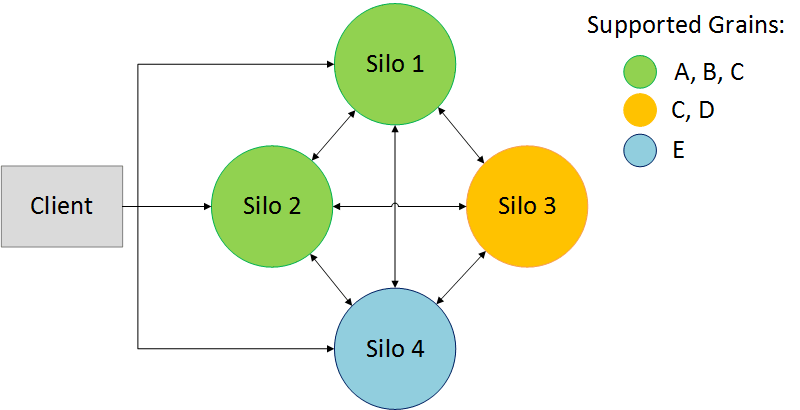

# 非均质silos

## 概述

在给定的集群上，silos可以支持一组不同的Grains类型：

在本例中，集群支持类型为`一`我是说，`乙`我是说，`C类`，请`丁`我是说，`E类`：

-   grains类型`一`和`乙`可存储在silos1和2上。
-   grains类型`C类`可存储在silos1、2或3上。
-   grains类型`丁`只能放在silos3上
-   grains类型`E类`只能存储在silos4上。

所有的silos都应该引用集群的所有Grains类型的接口，但是Grains类应该只被将承载它们的silos引用。

客户端不知道哪个silos支持给定的Grains类型。

**给定的Grains类型实现在支持它的每个silos上必须相同。以下方案无效：**

在silos1和2上：

```csharp
public class C: Grain, IMyGrainInterface
{
   public Task SomeMethod() { … }
}
```

在silos3上

```csharp
public class C: Grain, IMyGrainInterface, IMyOtherGrainInterface
{
   public Task SomeMethod() { … }
   public Task SomeOtherMethod() { … }
}
```

## 配置

不需要配置，您可以在集群中的每个silos上部署不同的二进制文件。但是，如果需要，可以更改silo和客户端检查属性支持的类型更改的间隔`类型映射刷新间隔`从`类型管理选项`

出于测试目的，可以使用属性`排除雨水类型`在里面`GrainClass选项`，这是要在silos上排除的类型的列表名称。

## 限制

-   如果受支持的粒度类型集发生更改，则不会通知已连接的客户端。在前面的示例中：*如果silo 4离开集群，客户端仍将尝试调用类型为grain的`E类`是的。它将在运行时失败，并带有orleansexception。*如果客户端是在silos4加入群集之前连接到群集的，则客户端将无法调用类型为`E类`是的。它会失败的
-   不支持无状态grains：集群中的所有silos必须支持同一组无状态grains。
