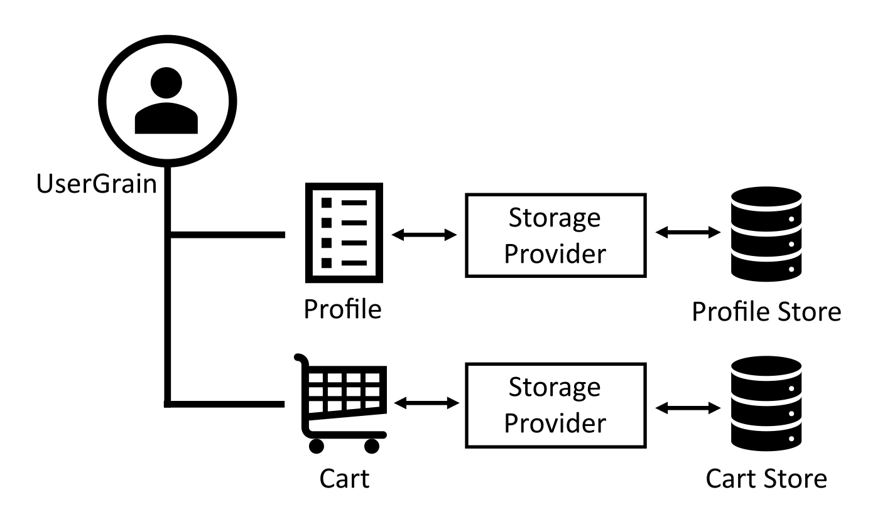

# 坚持不懈

Grains可以具有多个与之关联的命名持久数据对象。在激活Grains期间会从存储中加载此状态，以便在请求期间可以使用它们。粒度持久性使用可扩展的插件模型，因此可以使用任何数据库的存储提供程序。此持久性模型仅出于简化目的而设计，并不旨在涵盖所有数据访问模式。Grains还可以直接访问数据库，而无需使用Grains持久性模型。



在上图中，UserGrain有一个*个人资料*状态和*大车*状态，每个状态都存储在单独的存储系统中。

## 目标

1.  每个Grains有多个命名的持久数据对象。
2.  多个配置的存储提供程序，每个存储提供程序可以具有不同的配置并由不同的存储系统支持。
3.  存储提供商可以由社区开发和发布。
4.  存储提供者可以完全控制他们如何在持久性后备存储中存储Grains状态数据。结论：Orleans没有提供全面的ORM存储解决方案，但允许自定义存储提供商在需要时支持特定的ORM要求。

## 配套

可以在以下位置找到OrleansGrains存储提供商[NuGet](https://www.nuget.org/packages?q=Orleans+Persistence)。官方维护的软件包包括：

-   [Microsoft.Orleans.Persistence.AdoNet](https://www.nuget.org/packages/Microsoft.Orleans.Persistence.AdoNet)适用于ADO.NET支持的SQL数据库和其他存储系统。有关更多信息，请参见[ADO.NET粒度持久性](relational_storage.md)。
-   [Microsoft.Orleans.Persistence.AzureStorage](https://www.nuget.org/packages/Microsoft.Orleans.Persistence.AzureStorage)通过Azure Table Storage API访问Azure存储，包括Azure Blob存储，Azure表存储和Azure CosmosDB。有关更多信息，请参见[Azure存储粒度持久性](azure_storage.md)。
-   [Microsoft.Orleans.Persistence.DynamoDB](https://www.nuget.org/packages/Microsoft.Orleans.Persistence.DynamoDB)适用于Amazon DynamoDB。有关更多信息，请参见[Amazon DynamoDB粒度持久性](dynamodb_storage.md)。

## API

Grains与它们的持久状态相互作用`IPersistentState <TState>`哪里`州`是可序列化状态类型：

```csharp
public interface IPersistentState<TState> where TState : new()
{
  TState State { get; set; }
  string Etag { get; }
  Task ClearStateAsync();
  Task WriteStateAsync();
  Task ReadStateAsync();
}
```

的实例`IPersistentState <TState>`作为构造函数参数注入到Grains中。这些参数可以用`[PersistentState（stateName，storageName）]`属性以标识要注入的状态的名称以及提供状态的存储提供程序的名称。以下示例通过将两个命名状态注入到`UserGrain`构造函数：

```csharp
public class UserGrain : Grain, IUserGrain
{
  private readonly IPersistentState<ProfileState> _profile;
  private readonly IPersistentState<CartState> _cart;

  public UserGrain(
    [PersistentState("profile", "myGrainStorage")] IPersistentState<ProfileState> profile,
    [PersistentState("cart", "cartStorage")] IPersistentState<CartState> cart,
    )
  {
    _profile = profile;
    _cart = cart;
  }
}
```

即使它们是同一类型，不同的粒度类型也可以使用不同的已配置存储提供程序：例如，两个不同的Azure Table Storage提供程序实例连接到不同的Azure存储帐户。

### 阅读状态

当激活grains时，将自动读取grains状态，但是grains负责在必要时显式触发任何更改的grains状态的写入。

如果某个Grains希望从后备存储中明确重新读取该Grains的最新状态，则该Grains应调用`ReadStateAsync（）`方法。这将通过存储提供者从持久性存储中重新加载Grains状态，并且当数据库中的Grains状态的先前内存中副本将被覆盖并替换时，`ReadStateAsync（）` `任务`完成。

使用以下命令访问状态值`州`属性。例如，以下方法访问上面的代码中声明的配置文件状态：

```csharp
public Task<string> GetNameAsync() => Task.FromResult(_profile.State.Name);
```

无需致电`ReadStateAsync（）`在正常操作期间：在激活期间自动加载状态。然而，`ReadStateAsync（）`可以用来刷新外部修改的状态。

见[失败模式](#FailureModes)以下部分提供了有关错误处理机制的详细信息。

### 写作状态

状态可以通过`州`属性。修改后的状态不会自动保持。相反，开发人员通过调用`WriteStateAsync（）`方法。例如，以下方法更新一个属性`州`并保持更新状态：

```csharp
public async Task SetNameAsync(string name)
{
  _profile.State.Name = name;
  await _profile.WriteStateAsync();
}
```

从概念上讲，Orleans运行时将在任何写入操作期间获取Grains状态数据对象的深层副本以供其自己使用。在幕后，运行时*可能*在保留预期的逻辑隔离语义的前提下，使用优化规则和试探法避免在某些情况下执行部分或全部深度复制。

见[失败模式](#FailureModes)以下部分提供了有关错误处理机制的详细信息。

### 清算国

的`ClearStateAsync（）`方法清除存储中的Grains状态。根据提供者，此操作可以选择完全删除grains状态。

## 入门

在Grains可以使用持久性之前，必须在silos上配置存储提供程序。

首先，配置存储提供程序：

```csharp
var host = new HostBuilder()
  .UseOrleans(siloBuilder =>
  {
    // Configure Azure Table storage using the name "profileStore"
    siloBuilder.AddAzureTableGrainStorage(
      name: "profileStore",
      configureOptions: options =>
      {
        // Use JSON for serializing the state in storage
        options.UseJson = true;

        // Configure the storage connection key
        options.ConnectionString = "DefaultEndpointsProtocol=https;AccountName=data1;AccountKey=SOMETHING1";
      });
    // -- other options
  })
  .Build();
```

现在，已经使用名称配置了存储提供程序`“ profileStore”`，我们可以从Grains访问此提供程序。

持久状态可以通过两种主要方式添加到Grains中：

1.  通过注射`IPersistentState <TState>`进入Grains的构造函数
2.  通过继承`grains<TState>`

推荐的增加Grains储藏量的方法是通过注入`IPersistentState <TState>`关联到Grains的构造函数`[PersistentState（“ stateName”，“ providerName”）]`属性。有关详细信息[`grains<TState>`， 见下文](#using-grainlttstategt-to-add-storage-to-a-grain)。仍支持此功能，但被认为是旧版。

声明一个类来保持我们的Grains状态：

```csharp
[Serializable]
public class ProfileState
{
  public string Name { get; set; }

  public Date DateOfBirth
}
```

注入`IPersistentState <配置文件状态>`到Grains的构造函数中：

```csharp
public class UserGrain : Grain, IUserGrain
{
  private readonly IPersistentState<ProfileState> _profile;

  public UserGrain([PersistentState("profile", "profileStore")] IPersistentState<ProfileState> profile)
  {
    _profile = profile;
  }
}
```

注意：配置文件状态在注入到构造函数中时不会被加载，因此那时访问它是无效的。该状态将在`OnActivateAsync`叫做。

现在，grain具有持久状态，我们可以添加读取和写入状态的方法：

```csharp
public class UserGrain : Grain, IUserGrain
{
  private readonly IPersistentState<ProfileState> _profile;

  public UserGrain([PersistentState("profile", "profileStore")] IPersistentState<ProfileState> profile)
  {
    _profile = profile;
  }

  public Task<string> GetNameAsync() => Task.FromResult(_profile.State.Name);

  public async Task SetNameAsync(string name)
  {
    _profile.State.Name = name;
    await _profile.WriteStateAsync();
  }
}
```

## 持久性操作的失败模式<a name="FailureModes"></a>

### 读取操作的失败模式

在最初读取特定Grains的状态数据期间，存储提供者返回的故障将导致该Grains的激活操作失败；在这种情况下，*不*可以打电话给那个Grains的`OnActivateAsync（）`生命周期回调方法。对导致激活的那个Grains的原始请求将以与Grains激活过程中的其他任何失败相同的方式被发回给调用者。存储提供程序在读取特定Grains的状态数据时遇到失败，将导致`ReadStateAsync（）` `任务`被指责。Grains可以选择处理或忽略该故障`任务`，就像其他任何东西一样`任务`在Orleans。

由于缺少/错误的存储提供程序配置，任何在silos启动时无法加载消息的尝试都会返回永久错误`Orleans.BadProviderConfigException`。

### 写入操作的失败模式

存储提供程序在写入特定Grains的状态数据时遇到失败，将导致`WriteStateAsync（）` `任务`被指责。通常，这将意味着只要将`WriteStateAsync（）` `任务`正确地链接到最终收益`任务`对于这种Grains方法。但是，某些高级方案可能会编写粒度代码来专门处理此类写错误，就像它们可以处理任何其他错误一样`任务`。

执行错误处理/恢复代码的Grains*必须*捕获异常/错误`WriteStateAsync（）` `任务`而不重新抛出以表示它们已成功处理了写入错误。

## 推荐建议

### 使用JSON序列化或其他允许版本的序列化格式

代码会随着时间的推移而发展，并且通常还包括存储类型。为了适应这些更改，应配置适当的串行器。对于大多数存储提供商而言，`杰森`选项或类似选项可用于将JSON用作序列化格式。确保在发展数据合同时，已经存储的数据仍然可以加载。

## 使用Grains\<州>为Grains增加存储量

**注意：**使用`grains<T>`考虑增加Grains的储存量*遗产*功能：应使用以下方式添加Grains存储`IPersistentState <T>`如前所述。

继承自的Grains类`grains<T>`（哪里`Ť`是需要保留的特定于应用程序的状态数据类型），将从指定存储中自动加载其状态。

此类Grains标有`[StorageProvider]`该属性指定一个存储提供程序的命名实例，该实例用于读取/写入此Grains的状态数据。

```csharp
[StorageProvider(ProviderName="store1")]
public class MyGrain : Grain<MyGrainState>, /*...*/
{
  /*...*/
}
```

的`grains<T>`基类定义了以下方法供子类调用：

```csharp
protected virtual Task ReadStateAsync() { /*...*/ }
protected virtual Task WriteStateAsync() { /*...*/ }
protected virtual Task ClearStateAsync() { /*...*/ }
```

这些方法的行为对应于`IPersistentState <TState>`较早定义。

## 创建存储提供者

状态持久性API有两部分：通过`IPersistentState <T>`要么`grains<T>`，以及存储提供商API（以`IGrain存储`—存储提供程序必须实现的接口：

```csharp
/// <summary>
/// Interface to be implemented for a storage able to read and write Orleans grain state data.
/// </summary>
public interface IGrainStorage
{
  /// <summary>Read data function for this storage instance.</summary>
  /// <param name="grainType">Type of this grain [fully qualified class name]</param>
  /// <param name="grainReference">Grain reference object for this grain.</param>
  /// <param name="grainState">State data object to be populated for this grain.</param>
  /// <returns>Completion promise for the Read operation on the specified grain.</returns>
  Task ReadStateAsync(string grainType, GrainReference grainReference, IGrainState grainState);

  /// <summary>Write data function for this storage instance.</summary>
  /// <param name="grainType">Type of this grain [fully qualified class name]</param>
  /// <param name="grainReference">Grain reference object for this grain.</param>
  /// <param name="grainState">State data object to be written for this grain.</param>
  /// <returns>Completion promise for the Write operation on the specified grain.</returns>
  Task WriteStateAsync(string grainType, GrainReference grainReference, IGrainState grainState);

  /// <summary>Delete / Clear data function for this storage instance.</summary>
  /// <param name="grainType">Type of this grain [fully qualified class name]</param>
  /// <param name="grainReference">Grain reference object for this grain.</param>
  /// <param name="grainState">Copy of last-known state data object for this grain.</param>
  /// <returns>Completion promise for the Delete operation on the specified grain.</returns>
  Task ClearStateAsync(string grainType, GrainReference grainReference, IGrainState grainState);
}
```

通过实现此接口来创建自定义存储提供程序，并[注册](#registering-a-storage-provider)该实施。有关现有存储提供程序实现的示例，请参见[`AzureBlobGrainStorage`](https://github.com/dotnet/orleans/blob/af974d37864f85bfde5dc02f2f60bba997f2162d/src/Azure/Orleans.Persistence.AzureStorage/Providers/Storage/AzureBlobStorage.cs)。

### 存储提供程序语义

特定于不透明的提供者`埃塔格`值（`串`）*可能*由存储提供者设置为读取状态时填充的Grains状态元数据的一部分。一些提供商可能选择将此保留为`空值`如果他们不使用`埃塔格`s。

当存储提供程序检测到一个写操作时，任何尝试执行写操作的尝试`埃塔格`约束违反*应该*引起写`任务`被短暂的错误所误导`Orleans.InconsistentStateException`并包装基础存储异常。

```csharp
public class InconsistentStateException : OrleansException
{
  public InconsistentStateException(
    string message,
    string storedEtag,
    string currentEtag,
    Exception storageException)
    : base(message, storageException)
  {
    this.StoredEtag = storedEtag;
    this.CurrentEtag = currentEtag;
  }

  public InconsistentStateException(string storedEtag, string currentEtag, Exception storageException)
    : this(storageException.Message, storedEtag, currentEtag, storageException)
  { }

  /// <summary>The Etag value currently held in persistent storage.</summary>
  public string StoredEtag { get; private set; }
  
  /// <summary>The Etag value currently held in memory, and attempting to be updated.</summary>
  public string CurrentEtag { get; private set; }
}
```

存储操作中的任何其他故障情况*必须*导致退货`任务`会被打破，并指出底层存储问题。在许多情况下，此异常可能会返回给调用方，后者通过在Grains上调用方法来触发存储操作。重要的是要考虑调用者是否可以反序列化此异常。例如，客户端可能尚未加载包含异常类型的特定持久性库。因此，建议将异常转换为可以传播回调用方的异常。

### 数据映射

各个存储提供者应决定如何最好地存储Grains状态-blob（各种格式/序列化形式）或每字段列是显而易见的选择。

### 注册存储提供商

Orleans运行时将从服务提供商那里解析存储提供商（`IServiceProvider`）创建纹理时。运行时将解析一个实例`IGrain存储`。如果存储提供者已命名，例如通过`[PersistentState（stateName，storageName）]`属性，然后是的命名实例`IGrain存储`将得到解决。

注册的命名实例`IGrain存储`， 使用`IServiceCollection.AddSingletonNamedService`扩展方法，以[AzureTableGrainStorage提供程序在这里](https://github.com/dotnet/orleans/blob/af974d37864f85bfde5dc02f2f60bba997f2162d/src/Azure/Orleans.Persistence.AzureStorage/Hosting/AzureTableSiloBuilderExtensions.cs#L78)。
