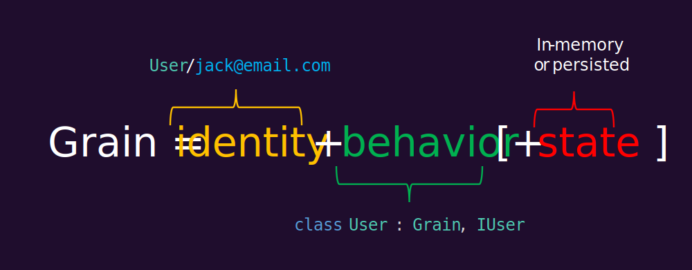
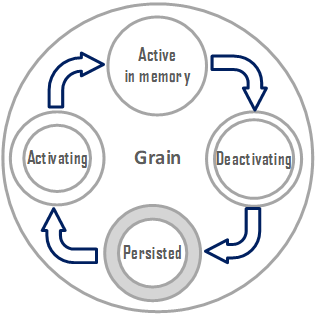

### Orleans是一个用于构建健壮、可伸缩的分布式应用程序的跨平台框架

Orleans建立在.NET开发人员生产力的基础上，并将其引入分布式应用程序的世界，如云服务。Orleans从单一的本地服务器扩展到云中的全球分布、高可用性应用程序。

Orleans采用了熟悉的概念，如对象、接口、异步/等待和try/catch，并将它们扩展到多服务器环境。因此，它可以帮助有单服务器应用经验的开发人员过渡到构建弹性、可伸缩的云服务和其他分布式应用程序。因此，Orleans经常被称为“分布式.NET”。

它是由[微软研究院](http://research.microsoft.com/projects/orleans/)并介绍了[虚拟演员模型](http://research.microsoft.com/apps/pubs/default.aspx?id=210931)作为为云时代构建新一代分布式系统的新方法。Orleans的核心贡献是它的编程模型，它在不限制功能或对开发人员施加繁重约束的情况下，缓和了高度并行分布式系统固有的复杂性。

## Grains



任何Orleans应用程序的基本构建块都是*grain*. grains是由用户定义的身份、行为和状态组成的实体。grains标识是用户定义的键，使grains始终可供调用。Grains可以通过强类型通信接口（contract）被其他Grains或Web前端等外部客户机调用。每个grains都是实现一个或多个这些接口的类的一个实例。

Grains可以具有挥发性和/或持久性状态，可以存储在任何存储系统中。因此，grains隐式地划分应用程序状态，从而实现自动可伸缩性并简化故障恢复。当Grain处于活动状态时，Grain状态被保存在内存中，从而降低了延迟和数据存储的负载。

<p align="center">
  
</p>

grains的实例化由Orleans运行时根据需要自动执行。暂时不使用的grains会自动从内存中删除以释放资源。这是有可能的，因为它们具有稳定的身份，允许调用grains，不管它们是否已经加载到内存中。这还允许透明地从失败中恢复，因为调用方不需要知道在任何时间点在哪个服务器上实例化了一个grain。Grains有一个受管理的生命周期，Orleans运行时负责激活/停用Grains，并根据需要存储/定位Grains。这允许开发人员编写代码，就好像所有的grains总是在内存中一样。

总的来说，稳定的标识、有状态性和可管理的生命周期是构建在Orleans之上的系统可伸缩、高性能的核心因素，&可靠，不必强迫开发人员编写复杂的分布式系统代码。

### 示例：物联网云后端

考虑一个云后端[物联网](https://en.wikipedia.org/wiki/Internet_of_things)系统。此应用程序需要处理传入的设备数据、筛选、聚合和处理这些信息，并允许向设备发送命令。在Orleans，人们很自然地用一种Grains来模拟每一种设备，这种Grains变成了*数码双胞胎*它所对应的物理设备。这些grains将最新的设备数据保存在内存中，这样就可以快速地查询和处理它们，而不需要直接与物理设备通信。通过观察来自设备的时间序列数据流，grains可以检测条件的变化，例如测量值超过阈值，并触发一个动作。

一个简单的恒温器可以建模如下：

```C#
public interface IThermostat : IGrainWithStringKey
{
  Task<List<Command>> OnUpdate(ThermostatStatus update);
}
```

从Web前端从恒温器到达的事件可以通过调用`更新函数`方法，它可以选择将命令返回给设备。

```C#
var thermostat = client.GetGrain<IThermostat>(id);
return await thermostat.OnUpdate(update);
```

相同的恒温器grains可实现单独的接口，以便控制系统与：

```C#
public interface IThermostatControl : IGrainWithStringKey
{
  Task<ThermostatStatus> GetStatus();

  Task UpdateConfiguration(ThermostatConfiguration config);
}
```

这两个接口(`恒温箱`和`ITH恒温控制`)由单个实现类实现：

```C#
public class ThermostatGrain : Grain, IThermostat, IThermostatControl
{
  private ThermostatStatus _status;
  private List<Command> _commands;

  public Task<List<Command>> OnUpdate(ThermostatStatus status)
  {
    _status = status;
    var result = _commands;
    _commands = new List<Command>();
    return Task.FromResult(result);
  }

  public Task<ThermostatStatus> GetStatus() => Task.FromResult(_status);
  
  public Task UpdateConfiguration(ThermostatConfiguration config)
  {
    _commands.Add(new ConfigUpdateCommand(config));
    return Task.CompletedTask;
  }
}
```

上面的Grains类不会保持其状态。[文档](grains/grain_persistence/index.zh.md)中提供了演示状态持久性的更彻底的示例。

## Orleans运行时

Orleans运行时为应用程序运行时的主要组件是*silos*，负责寄存Grains。通常，一组silos作为集群运行，以实现可伸缩性和容错性。当作为集群运行时，silos相互协调以分配工作、检测并从故障中恢复。运行时使集群中托管的grains能够像在单个进程中一样相互通信。

除了核心编程模型之外，silos还为grains提供了一组运行时服务，例如计时器、提醒（persistent timers）、持久性、事务、流等。见[特色部分](#features)下面是更多细节。

Web前端和其他外部客户端使用客户端库调用集群中的grains，该库自动管理网络通信。为了简单起见，客户机也可以与silos在同一进程中共同托管。

Orleans与.NET Standard 2.0及更高版本兼容，运行在Windows、Linux和macOS上，采用完整的.NET Framework或.NET核心。

## 特征

### 坚持不懈

Orleans提供了一个简单的持久性模型，确保在处理请求之前，状态对grain是可用的，并且保持一致性。Grains可以有多个命名的持久性数据对象，例如，一个名为“profile”的用户概要文件，一个名为“inventory”的存储。此状态可以存储在任何存储系统中。例如，配置文件数据可以存储在一个数据库中，而库存存储在另一个数据库中。当一个grain正在运行时，这个状态被保存在内存中，这样就可以在不访问存储器的情况下处理读请求。当grains更新其状态时`state.WriteStateAsync()`call确保备份存储的持久性和一致性得到更新。有关详细信息，请参见[Grains持久性](grains/grain_persistence/index.zh.md)文档。

### 分布式ACID事务

除了上面描述的简单持久性模型之外，grains还可以*事务状态*. 多个grains可以参与[酸性](https://en.wikipedia.org/wiki/ACID)不管事务的状态最终存储在何处。Orleans的事务是分布式和分散的（没有中央事务管理器或事务协调器），并且[可串行隔离](https://en.wikipedia.org/wiki/Isolation_(database_systems)#Isolation_levels). 有关Orleans交易的更多信息，请参阅[文档](grains/transactions.zh.md)以及[微软研究院技术报告](https://www.microsoft.com/en-us/research/publication/transactions-distributed-actors-cloud-2/).

### Streams

流帮助开发人员以近乎实时的方式处理一系列数据项。Orleans的Streams*管理*：在粒度或客户端发布到流或订阅流之前，不需要创建或注册流。这使得流生产者和消费者之间以及与基础设施之间的更大程度的分离。流处理是可靠的：grains可以存储检查点（游标），并在激活期间或之后的任何时间重置为存储的检查点。Streams支持向使用者批量传递消息，以提高效率和恢复性能。流由排队服务支持，如Azure事件中心、Amazon Kinesis等。可以将任意数量的流多路复用到较小数量的队列上，并且处理这些队列的责任在集群中均衡。

### 计时器&提醒

提醒是一种持久的Grains调度机制。它们可用于确保在将来某个时间点完成某些操作，即使此时grains当前未激活。计时器是非持久性的提醒物，可用于不需要可靠性的高频事件。有关详细信息，请参见[计时器和提醒](grains/timers_and_reminders.zh.md)文档。

### 灵活的Grains存储

当一个Grains在Orleans被激活时，运行时决定在哪个服务器（silos）上激活该Grains。这就是所谓的Grains存储。Orleans的布局过程是完全可配置的：开发人员可以从一组现成的布局策略中进行选择，例如随机、首选本地和基于负载的，或者可以配置自定义逻辑。这样就可以充分灵活地决定在哪里产生grains。例如，可以将粒度存储在服务器上，靠近它们需要操作的资源或与之通信的其他粒度。

### Grains版本化&异构集群

应用程序代码会随着时间的推移而发展，以安全地解释这些更改的方式升级实时生产系统可能是一项挑战，尤其是在有状态的系统中。Orleans的Grains界面可以选择性地进行版本控制。集群维护了一个映射，映射出集群中的哪些竖井上有哪些grain实现以及这些实现的版本。运行时将此版本信息与存储策略结合使用，以便在将调用路由到grains时做出存储决策。除了安全地更新版本化的grains之外，这还支持异构集群，其中不同的silo具有不同的grain实现集。有关详细信息，请参见[Grains版本化](grains/grain_versioning/grain_versioning.zh.md)文档。

### 弹性伸缩性&容错

Orleans的设计是弹性伸缩的。当silos加入集群时，它能够接受新的激活，当silos离开集群时（由于规模缩小或机器故障），在该silos上激活的Grains将根据需要在其余silos上重新激活。一个Orleans集群可以缩小到一个silos。支持弹性伸缩性的相同属性也支持容错：集群自动检测并从故障中快速恢复。

### 到处跑

Orleans运行任何支持.NETCore或.NETFramework的地方。这包括在Linux、Windows和macOS上托管，并部署到Kubernetes、虚拟机或物理机、本地或云中，以及PaaS服务（如Azure云服务）。

### 无状态 Worker

无状态工作者是特殊标记的grains，没有任何关联状态，可以同时在多个silos上激活。这样就可以提高无状态函数的并行性。有关详细信息，请参见[无状态工人Grains](grains/stateless_worker_grains.zh.md)文档。

### Grains拦截器

许多Grains的共同逻辑可以表示为[Grains拦截器](grains/interceptors.zh.md). Orleans支持呼入和呼出的过滤器。过滤器的一些常见用例有：授权、日志记录和遥测以及错误处理。

### 请求上下文

元数据和其他信息可以通过使用[请求上下文](grains/request_context.zh.md). 请求上下文可用于打孔分布式跟踪信息或任何其他用户定义的值。

## 入门

请看[入门教程](tutorials_and_samples/tutorial_1.zh.md).

### 建筑

在Windows上，运行`生成.cmd`脚本在本地构建NuGet包，然后从中引用所需的NuGet包`/工件/发布/*`. 你可以跑了`测试命令`运行所有BVT测试，以及`测试命令`同时运行功能测试。

在Linux和macOS上，运行`建筑.sh`脚本或`dotnet构建/Orleans科技平台.sln`建造Orleans。

## 官方建筑

最新的稳定，生产质量发布[在这里](https://github.com/dotnet/orleans/releases/latest).

夜间生成发布到<https://dotnet.myget.org/gallery/orleans-ci>. 这些构建通过了所有的功能测试，但是没有像发布到NuGet的稳定版本或预发布版本那样进行彻底测试。

### 在项目中使用夜间构建包

要在项目中使用夜间生成，请使用以下任一方法添加MyGet提要：

1.  更改.csproj文件以包含此节：

```xml
  <RestoreSources>
    $(RestoreSources);
    https://dotnet.myget.org/F/orleans-ci/api/v3/index.json;
  </RestoreSources>
```

或

2.  创建`NuGet.config文件`包含以下内容的解决方案目录中的文件：

```xml
<?xml version="1.0" encoding="utf-8"?>
<configuration>
 <packageSources>
  <clear />
  <add key="orleans-ci" value="https://dotnet.myget.org/F/orleans-ci/api/v3/index.json" />
  <add key="nuget" value="https://api.nuget.org/v3/index.json" />
 </packageSources>
</configuration>
```

## 社区

-   提问方式[在GitHub上打开问题](https://github.com/dotnet/orleans/issues)或者在[堆栈溢出](https://stackoverflow.com/questions/ask?tags=orleans)
-   [在Gitter上聊天](https://gitter.im/dotnet/orleans)
-   [Orleans博客](https://dotnet.github.io/orleans/blog/)
-   跟随[@Orleans小姐](https://twitter.com/msftorleans)Orleans公告的Twitter帐户。
-   [OrleansContrib-面向Orleans社区附加组件的GitHub组织](https://github.com/OrleansContrib/)各种社区项目，包括监视、设计模式、存储提供程序等。
-   开发人员希望[为Orleans贡献代码更改](http://dotnet.github.io/orleans/Community/Contributing.html).
-   我们还鼓励您报告错误或通过启动新的[线](https://github.com/dotnet/orleans/issues)在GitHub上。

## 许可证

本项目根据[麻省理工学院执照](https://github.com/dotnet/orleans/blob/master/LICENSE).

## 快速链接

-   [Microsoft研究项目主页](http://research.microsoft.com/projects/orleans/)
-   技术报告：[可编程性和可扩展性的分布式虚拟参与者](http://research.microsoft.com/apps/pubs/default.aspx?id=210931)
-   [Orleans文件](http://dotnet.github.io/orleans/)
-   [贡献](http://dotnet.github.io/orleans/Community/Contributing.html)

## Orleans的起源

Orleans创建于[微软研究并设计用于云计算](https://www.microsoft.com/en-us/research/publication/orleans-distributed-virtual-actors-for-programmability-and-scalability/). 自2011年以来，它已被多家微软产品集团广泛应用于云计算和内部部署，其中最著名的是游戏工作室，如343 Industries和联盟作为Halo 4和5、Gears of War 4背后的云服务平台，以及其他一些公司。

Orleans于2015年1月开放源码，吸引了许多开发商成立[是.NET生态系统中最具活力的开源社区之一](http://mattwarren.org/2016/11/23/open-source-net-2-years-later/). 在开发人员社区和微软Orleans团队的积极合作中，每天都会添加和改进特性。微软研究院继续与Orleans团队合作，推出新的主要功能，如[地理分布](https://www.microsoft.com/en-us/research/publication/geo-distribution-actor-based-services/), [索引](https://www.microsoft.com/en-us/research/publication/indexing-in-an-actor-oriented-database/)，和[分布式事务](https://www.microsoft.com/en-us/research/publication/transactions-distributed-actors-cloud-2/)，推动了最新技术的发展。对于许多.NET开发人员来说，Orleans已经成为构建分布式系统和云服务的首选框架。
