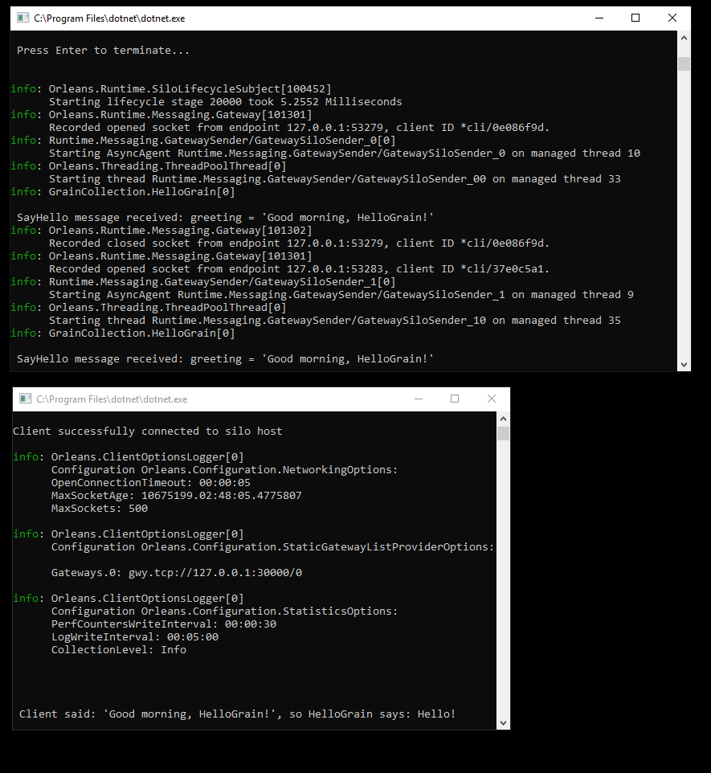

# 教程一-创建最小的奥尔良应用程序

本教程提供有关创建基本运行的Orleans应用程序的逐步说明。它被设计为自包含且极简的，具有以下特征：

-   它仅依赖NuGet软件包
-   已使用Orleans 2.2.0在Visual Studio 2017中进行了测试
-   它不依赖外部存储

请记住，这只是一个教程，缺少适当的错误处理和其他对生产环境有用的东西。但是，它应该帮助读者真正了解奥尔良的结构，并使他们将继续学习的重点放在与他们最相关的部分上。

## 项目设置

在本教程中，我们将创建4个项目：

-   一个包含谷物接口的库
-   一个包含谷物类的库
-   一个控制台应用程序来托管我们的筒仓
-   一个控制台应用程序来托管我们的客户

遵循本教程之后，完整的解决方案应如下所示：


### 在Visual Studio中创建结构

注意：您可以在c＃中为这些项目中的每个项目使用默认项目类型。您将在下面为每个项目提供的代码替换默认代码。您可能还需要添加`使用`陈述。

1.  首先在新解决方案中创建一个控制台应用程序（.NET Core）项目。调用项目部分`筒仓`并命名解决方案`奥尔良世界`。
2.  添加另一个控制台应用程序（.NET Core）项目并将其命名`客户`。
3.  添加一个类库（.NET标准）并命名`颗粒界面`。
4.  添加另一个类库（.NET标准）并命名`谷物`。

#### 删除默认源文件

1.  从谷物中删除Class1.cs
2.  从GrainInterfaces删除Class1.cs

### 添加参考

1.  `谷物`参考资料`颗粒界面`。
2.  `筒仓`参考资料`颗粒界面`和`谷物`。
3.  `客户`参考资料`颗粒界面`。

## 添加奥尔良NuGet软件包

1.  在筒仓项目中，添加`微软奥尔良服务器`NuGet软件包。
2.  在客户端项目中，添加`微软奥尔良客户`NuGet软件包。
3.  在GrainInterfaces和Grains项目中，添加`微软奥尔良核心抽象`和`Microsoft.Orleans.CodeGenerator.MSBuild`包。
4.  在“谷物”项目中，添加`Microsoft.Extensions.Logging.Abstractions`用于记录的软件包。
5.  在客户和筒仓项目中，添加`Microsoft.Extensions.Logging.Console`，以便他们可以在控制台窗口中打印日志。

`微软奥尔良服务器`和`微软奥尔良客户`是元软件包，它们带来了在筒仓和客户端最可能需要的依赖关系。

`微软奥尔良核心抽象`在任何地方都需要。两者都包含`微软奥尔良服务器`和`微软奥尔良客户`。

`Microsoft.Orleans.CodeGenerator.MSBuild`自动生成调用谷物通过机器边界所需的代码。所以两者都需要`颗粒界面`和`谷物`项目。

## 定义颗粒界面

在GrainInterfaces项目中，添加一个`IHello.cs`代码文件，并在其中定义以下IHello接口：

```csharp
using System.Threading.Tasks;

namespace OrleansBasics
{
    public interface IHello : Orleans.IGrainWithIntegerKey
    {
        Task<string> SayHello(string greeting);
    }
}
```

## 定义谷物等级

在谷物项目中，添加一个`HelloGrain.cs`代码文件，并在其中定义以下类：

```csharp
using Microsoft.Extensions.Logging;
using System.Threading.Tasks;

namespace OrleansBasics
{
    public class HelloGrain : Orleans.Grain, IHello
    {
        private readonly ILogger logger;

        public HelloGrain(ILogger<HelloGrain> logger)
        {
            this.logger = logger;
        }

        Task<string> IHello.SayHello(string greeting)
        {
            logger.LogInformation($"\n SayHello message received: greeting = '{greeting}'");
            return Task.FromResult($"\n Client said: '{greeting}', so HelloGrain says: Hello!");
        }
    }
}
```

### 创建筒仓– Program.cs

在这一步，我们添加代码以初始化将托管和运行我们的谷物的服务器-筒仓。我们将在此处使用开发群集提供程序，以便我们可以在本地运行所有内容，而无需依赖外部存储系统。您可以在[本地开发配置](http://dotnet.github.io/orleans/Documentation/clusters_and_clients/configuration_guide/local_development_configuration.html)奥尔良文档的页面。我们将在其中运行带有单个筒仓的集群。

将以下代码添加到Silo项目的Program.cs中：

```csharp
using System;
using System.Threading.Tasks;
using Microsoft.Extensions.Logging;
using Orleans;
using Orleans.Configuration;
using Orleans.Hosting;

namespace OrleansBasics
{
    public class Program
    {
        public static int Main(string[] args)
        {
            return RunMainAsync().Result;
        }

        private static async Task<int> RunMainAsync()
        {
            try
            {
                var host = await StartSilo();
                Console.WriteLine("\n\n Press Enter to terminate...\n\n");
                Console.ReadLine();

                await host.StopAsync();

                return 0;
            }
            catch (Exception ex)
            {
                Console.WriteLine(ex);
                return 1;
            }
        }

        private static async Task<ISiloHost> StartSilo()
        {
            // define the cluster configuration
            var builder = new SiloHostBuilder()
                .UseLocalhostClustering()
                .Configure<ClusterOptions>(options =>
                {
                    options.ClusterId = "dev";
                    options.ServiceId = "OrleansBasics";
                })
                .ConfigureApplicationParts(parts => parts.AddApplicationPart(typeof(HelloGrain).Assembly).WithReferences())
                .ConfigureLogging(logging => logging.AddConsole());

            var host = builder.Build();
            await host.StartAsync();
            return host;
        }
    }
}
```

### 创建客户端– Program.cs

最后，我们需要配置一个客户端与我们的谷物进行通信，将其连接到集群（其中有一个筒仓），然后调用谷物。请注意，群集配置必须与我们用于筒仓的配置匹配。有关客户端的更多信息，请参见[集群和客户](http://dotnet.github.io/orleans/Documentation/clusters_and_clients/index.html)奥尔良文档中的部分。

```csharp
using Microsoft.Extensions.Logging;
using Orleans;
using Orleans.Configuration;
using System;
using System.Threading.Tasks;

namespace OrleansBasics
{
    public class Program
    {
        static int Main(string[] args)
        {
            return RunMainAsync().Result;
        }

        private static async Task<int> RunMainAsync()
        {
            try
            {
                using (var client = await ConnectClient())
                {
                    await DoClientWork(client);
                    Console.ReadKey();
                }

                return 0;
            }
            catch (Exception e)
            {
                Console.WriteLine($"\nException while trying to run client: {e.Message}");
                Console.WriteLine("Make sure the silo the client is trying to connect to is running.");
                Console.WriteLine("\nPress any key to exit.");
                Console.ReadKey();
                return 1;
            }
        }

        private static async Task<IClusterClient> ConnectClient()
        {
            IClusterClient client;
            client = new ClientBuilder()
                .UseLocalhostClustering()
                .Configure<ClusterOptions>(options =>
                {
                    options.ClusterId = "dev";
                    options.ServiceId = "OrleansBasics";
                })
                .ConfigureLogging(logging => logging.AddConsole())
                .Build();

            await client.Connect();
            Console.WriteLine("Client successfully connected to silo host \n");
            return client;
        }

        private static async Task DoClientWork(IClusterClient client)
        {
            // example of calling grains from the initialized client
            var friend = client.GetGrain<IHello>(0);
            var response = await friend.SayHello("Good morning, HelloGrain!");
            Console.WriteLine("\n\n{0}\n\n", response);
        }
    }
}
```

## 运行应用程序

构建解决方案并运行筒仓。在收到确认信息后，表示正在运行筒仓（“按Enter键以终止...”），然后运行客户端。成功看起来像这样：



## 进一步阅读

-   [奥尔良包清单](http://dotnet.github.io/orleans/Documentation/core_concepts/what_are_orleans_packages.html)
-   [奥尔良配置指南](http://dotnet.github.io/orleans/Documentation/clusters_and_clients/configuration_guide/index.html)
-   [奥尔良最佳实践](https://www.microsoft.com/en-us/research/publication/orleans-best-practices)
