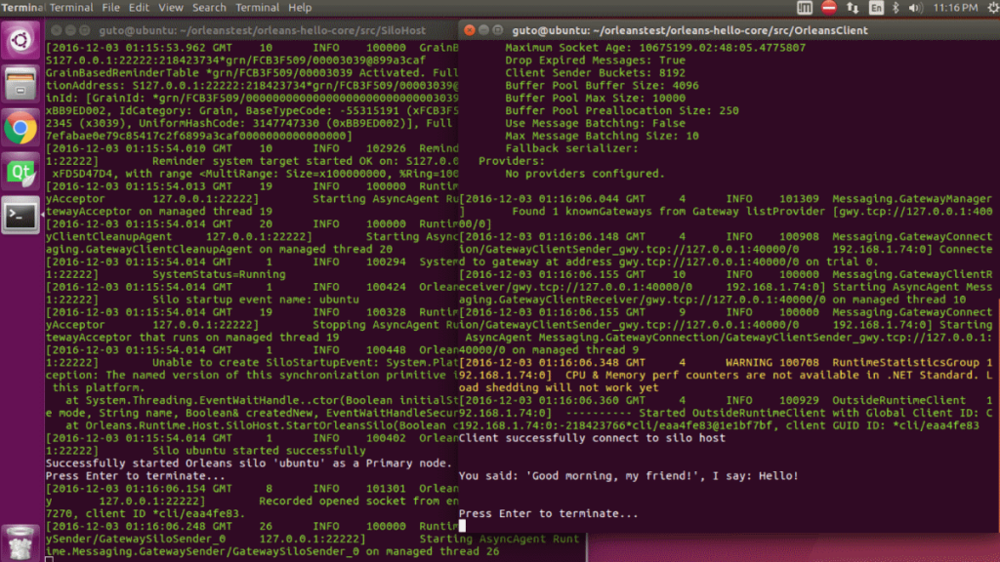

# 支持.NET Core的Orleans 2.0 Tech Preview

[朱利安·多明格斯（Julian Dominguez）](https://github.com/jdom)2016/12/5上午11:52:59

* * *

使Orleans与.NET Standard兼容已经是一个漫长的过程，但是我们终于有了一个最低限度的可行版本，可以开始在.NET Core中玩了！:)

Orleans2.0技术预览版1刚刚发布到MyGet：<https://dotnet.myget.org/gallery/orleans-ci>（要么<https://dotnet.myget.org/F/orleans-ci/api/v3/index.json>在NuGet中配置Feed）

## 与Orleans1.X的差异

Orleans2.0技术预览版不具备Orleans1.X的全部功能，因为我们移植了获得体面体验所需的最低要求，并且可以说是移植难度最大/风险最高的部分。我们希望从现在开始，其余扩展的迁移速度会更快。

此预发行版本中的一些显着差异或待处理事项：

-   Orleans代码生成
    -   只有在安装了.NET 4.6.2的Windows上进行构建时，构建时间代码生成器（Microsoft.Orleans.OrleansCodeGenerator.Build nuget程序包）才起作用。它还需要.NET Core Preview3工具或更高版本（如果是在VS中构建，则为VS2017 RC）。
    -   但是，运行时代码生成是跨平台工作的可行替代方法（通过引用Silo宿主和客户端项目中的Microsoft.Orleans.OrleansCodeGenerator程序包）。
-   为了获得可靠的群集成员身份，存储和流，目前仅迁移了Azure存储提供程序。其余的即将推出（或随时为它们贡献一个端口）。
-   .NET Standard中尚不提供BinaryFormatter（内置的.NET序列化），它已在Orleans中用作默认的后备序列化器（通常在序列化异常时使用）。现在，我们有了一个自定义的基于IL的后备序列化器，该序列化器应快速而强大，但如果您现有的代码依赖于它，则其行为可能会有所不同[可序列化]。
-   .NET标准中不支持System.Diagnostic.Trace.CorrelationManager.ActivityId。如果您依赖于此来关联Grains调用，请考虑改用Orleans.Runtime.RequestContext.ActivityId。

## 准备生产了吗？

没有。

大声明：我们在.NET中进行CI测试（因为我们的测试严重依赖AppDomains创建内存孤岛群集，而.NET Core不支持这些孤岛，但我们计划尽快解决）。我们已经在.NET Core（包括Windows和Linux）中完成了一些基本的手动测试，但是会遇到一些问题。获得反馈（和PR！）是此版本的主要目标之一，尚未在生产中使用。

此外，即使对于已完全移植的功能，也无法保证此技术预览版与Orleans 1.3完全向后兼容。一旦接近稳定版本，我们将列出所有已知的重大更改，以防您有兴趣将应用程序从1.3升级到2.0。因为此技术预览版不具备1.X发行版的全部功能，所以我们目前仅在MyGet中发行。

## 运行样本

我创建了一个在.NET Core中运行的小型Hello World示例应用程序，欢迎您使用它作为起点。

该示例位于此处：<https://github.com/jdom/OrleansHelloWorldSample.Core>

在Linux中运行Orleans的示例应用程序

享受它，玩弄它，并让我们知道您的想法，无论是GitHub问题，PR还是只是在我们的Gitter频道中闲逛。
