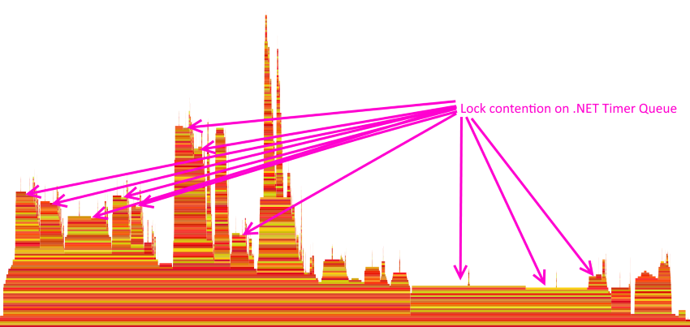

# 解决交易绩效之谜

[鲁本·邦德](https://github.com/ReubenBond)2018/12/7上午10:08:58

* * *

到达雷德蒙德并完成强制性的新员工入职培训后，我在Orleans团队的第一项任务就是协助进行一些持续的绩效调查，以确保内部人员可以使用Orleans的交易支持并因此而释放。

在针对我们的测试集群的压力/负载测试中，我们看到了严重的性能问题和大量事务失败。很大一部分事务一直暂停直到超时。

我们最初的调查集中在事务管理代码上。也许某个地方陷入僵局。我们采用了分而治之的方法，将内部交易组件替换为残存的变体。这个问题或多或少是孤立的`ITransactionalState <T>`实施取决于每个方面。事务状态负责加载和修改Grains状态并处理各种事务阶段（开始，准备，中止，提交，确认），并使用读写器锁在隔离保证内优化多个重叠事务。您可以看到这不是一个小数目的代码，但是事实证明，进一步隔离问题是困难的，原因不仅仅限于以下事实：取出任何一段代码都没有显着改善。

分析数据对于性能调查至关重要，因此，在请求获得直接访问我们测试集群中机器的权限之后，我们使用以下方法收集了ETW日志：[PerfView](https://github.com/Microsoft/perfview)使用与此类似的命令：

```
PerfView.exe /acceptEULA /noGui /threadTime /zip /maxCollectSec:30 /dataFile:1.etl collect
```

分析结果`.etl`本地文件，查看[火焰图](http://www.brendangregg.com/flamegraphs.html)对于堆栈跟踪样本，问题立即显而易见。

[](media/2018/12/lock_contention2.png)

PerfView使问题的原因显而易见。

详细信息太小而无法在该视图上阅读，但是通过将鼠标悬停在每个小节上，我们可以看到堆栈框架代表哪种方法。箭头指向CPU等待锁的堆栈帧，在这种情况下，该锁位于全局.NET Timer队列中。向右的平稳期来自于为计时器队列提供服务并触发到期的计时器的线程，这也需要获取锁定。

我们的负载测试在.NET Framework 4.6.2上运行，因此`System.Threading.Timer`是使用[计时器的全局队列（链接列表）](https://referencesource.microsoft.com/#mscorlib/system/threading/timer.cs,208ff87939c84fe3)由单个锁定对象保护。此队列上的任何操作都必须获得该锁。这是我们已经知道的，Orleans 2.1.0包含一个[PR减轻了此队列上的潜在锁争用](https://github.com/dotnet/orleans/pull/4399)用于我们的主要计时器来源（响应超时计时器）。

交易代码从不使用`计时器`，那为什么会有问题呢？交易利用`任务延迟`用于多种任务，它显示在大多数组件中。这就是为什么我们不能将性能问题缩小到一段特定的代码的原因。`任务延迟`使用一个`计时器`在引擎盖下，创建一个`计时器`可能会触发一次（如果未取消的话），并在不再需要时注销它。我们的使用`任务延迟`在负载下导致性能下降。

.NET Core 3.0用户可能从未见过这样的争用，因为.NET Core进行了大量工作以进行改进`计时器`和`任务延迟`性能。看到[＃14527](https://github.com/dotnet/coreclr/pull/14527)和[＃20302](https://github.com/dotnet/coreclr/pull/20302)。

我们如何解决这一争执？在确认这里的修复程序实际上可以解决该问题（成功！）之后，我着手实施一个有希望的简单替代品`任务延迟`。结果是[在这个公关](https://github.com/dotnet/orleans/pull/5201)。其工作原理的要点是它使用单个`计时器`实例以服务线程本地计时器集合。计时器的点火不需要精确，因此在这些用途中不必担心延迟点火。通过使用线程局部数据结构可很大程度上避免锁争用，但通过使用轻量级可重入器可保留安全性`互锁比较交换`锁。看到[公关](https://github.com/dotnet/orleans/pull/5201)更多细节。

该实施基于之前的工作[@dVakulen](https://github.com/dVakulen)在[＃2060年](https://github.com/dotnet/orleans/pull/2060/files#diff-a694ce799337a9585c6bb404e7ca2339)并导致吞吐量提高约4倍，而故障率降至零。谜团已揭开。
